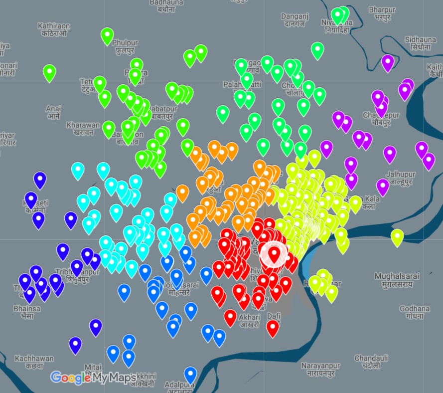

# Clustering - VRP

[](https://github.com/tterb/atomic-design-ui/blob/master/LICENSEs)


In this project we have optimise the vehicle routine problem by using clustering. Also founded a ```distance-based facilit allocation``` for the problem. This project is done under the guidance of [MKP Naik](https://www.linkedin.com/in/meghavatu-krishna-prasanna-naik-ba000a204/). He contributed most of VRP part of project.

## Destination of project

below image shows the output after opimising the solution. 



## Code 

 - ```latitude_longitude404.py``` :-  Used google geocoding to findout geographical coordinate.
 - ```dist_cal_404.py``` :- Calculating Eucludian distance between two points. Also create a distance matrix. 
 - ```point_movement.py``` :- Helps to findout nearest crowded exsiting point from cluster centriod to allocate atctual location of facility. 
 - ```vrp_cluster.py``` :- Used google OR-Tools to findout optimised solution for the problem. 

## Data

Our main goal is to design a cluster which is suitable for vehicle capacity as well as production capacity of individual  manufacturers. 

Based on that I managed to get data for clustering analysis is listed below:

1. Workers Information:  Ministry  of Textiles(Handloom)
2. Location Data : I used Google Map API to findout latitude & longitude of each Location
3. Capacity Data:  This data is collected from  transporter agencies.
4. Rating form Visitors.


### Note
All data has  not uploaded on github due to publication issue.
